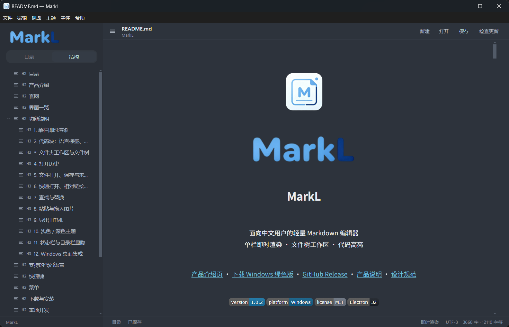

<p align="center">
  
</p>

<p align="center">
  
</p>

<h1 align="center">MarkL</h1>

<p align="center">
  面向中文用户的轻量 Markdown 编辑器<br />
  Typora 式单栏即时渲染 · 文件树工作区 · 代码高亮
</p>

<p align="center">
  <a href="docs/index.html">产品介绍页</a> ·
  <a href="https://github.com/LcodeCoder/markL/releases/download/1.0.2/MarkL.1.0.2.exe">下载 Windows 绿色版</a> ·
  <a href="https://github.com/LcodeCoder/markL/releases/latest">GitHub Release</a> ·
  <a href="PRODUCT.md">产品说明</a> ·
  <a href="DESIGN.md">设计规范</a>
</p>

<p align="center">
  
  
  
  
</p>

---

## 目录

- [产品介绍](#产品介绍)
- [静态介绍页](#静态介绍页)
- [界面一览](#界面一览)
- [功能说明](#功能说明)
- [支持的代码语言](#支持的代码语言)
- [快捷键](#快捷键)
- [菜单](#菜单)
- [下载与安装](#下载与安装)
- [本地开发](#本地开发)
- [打包](#打包)
- [项目结构](#项目结构)
- [技术栈](#技术栈)
- [安全与限制](#安全与限制)
- [贡献](#贡献)
- [许可证](#许可证)

## 产品介绍

MarkL 是序邻信息科技（xvlin Information）做的桌面 Markdown 编辑器。它把「写」放在中间：打开就是一篇正在排版的文档，而不是左边源码、右边预览的两页纸。

它适合：

- 用中文写技术文档、学习笔记、教程和项目说明
- 一个文件夹里同时管很多 `.md` / `.markdown` / `.txt`
- 想要比记事本直观、又比完整 IDE 轻的写作环境
- 需要在文档里写代码，并且立刻看到关键字颜色

当前正式下载是 GitHub Release **[1.0.2](https://github.com/LcodeCoder/markL/releases/tag/1.0.2)** 里的 Windows 绿色版。macOS 的图标和打包配置已经备好，需要在 Mac 上或通过 GitHub Actions 出包。

## 静态介绍页

仓库里带了一份不依赖构建的介绍页，打开就能看 Logo、界面示意和完整功能：

- 本地打开：[`docs/index.html`](docs/index.html)
- 界面截图：[`static/index.png`](static/index.png)
- 源码目录：`docs/`（Logo 在 `docs/brand/`）

介绍页是纯静态 HTML / CSS，不需要 Node，也不需要启动 Electron。之后如果要做 GitHub Pages，把站点源设为 `/docs` 即可。

## 界面一览

<p align="center">
  
</p>

```text
┌──────── 左侧目录栏 ────────┬────────────── 右侧文稿 ──────────────┐
│  MarkL Logo               │  ≡  标志  文件名.md  ●        新建 打开 保存 │
│  [打开文件夹]  +  刷新     │──────────────────────────────────────────│
│  当前文件夹名              │                                          │
│  ▾ 子文件夹               │          标题、段落、表格、代码块           │
│     文档.md               │          （即时渲染，所见即所得）            │
│  打开历史                 │                                          │
│    最近文件 / 文件夹       │──────────────────────────────────────────│
│  路径或扩展名提示          │  目录   已保存     即时渲染  UTF-8  字数   │
└───────────────────────────┴──────────────────────────────────────────┘
```

- **左侧**：品牌、「目录 / 结构」切换、打开文件夹、文件树或标题结构树、打开历史。
- **右侧上方**：当前文件名、未保存圆点、完整路径、新建 / 打开 / 保存、GitHub。
- **中间**：Vditor 即时渲染编辑区，正文铺满可用宽度。
- **底部**：保存状态、即时渲染 / 源码切换、编码、中文友好的字数统计。

## 功能说明

### 1. Typora 式即时渲染

默认不是「源码 | 预览」分栏，而是单栏边写边排：

- 输入 `#` 加空格变成标题，层级会立刻反映在字号上
- 列表、引用、表格、链接、图片、分隔线即时生效
- 支持 HTML 片段（例如居中）。历史文档里误写成 `cener` 的标签打开时会自动纠正为 `center`
- 可随时切到 **Markdown 源码** 看原始文本，再切回即时渲染
- 编辑区不再锁在很窄的 760px 居中栏，正文随窗口变宽，左右只留适量边距

切换方式：点状态栏的「即时渲染 / Markdown 源码」，或 `Ctrl + /`。

### 2. 代码块：语言标签、灰框、高亮、格式化

写代码的路径刻意做成接近 Typora：

1. 输入三个反引号 `` ``` ``
2. 回车，弹出「代码语言」列表
3. 输入 `java`、`js`、`py` 等关键词筛选
4. `Enter` / `Tab` 选定，`Esc` 取消，方向键移动
5. 灰底代码框顶部出现语言标签，框内关键字带颜色

高亮分两种状态，都由 highlight.js 完成：

| 状态 | 你看到的 | 实现 |
| --- | --- | --- |
| 光标在代码框里 | 边打字边高亮 | 透明源码 + 叠加层，不打断输入 |
| 光标离开代码框 | 灰框里颜色还在 | 预览节点会在编辑器重画后再补一次高亮 |

格式化：把光标放进代码块，按 `Ctrl + Alt + L`（菜单「编辑 → 格式化代码块」）。

- JavaScript / TypeScript / JSON / CSS / HTML：用 js-beautify
- 其他语言：按公共缩进整理，避免把代码结构弄乱

### 3. 文件夹工作区与文件树

Logo 下方有两个 tab：**目录** 看工作区文件树，**结构** 按当前文档的 `#` / `##` / `###` 列出标题树，点击即可跳到正文对应位置。

「打开文件夹」之后，目录 tab 列出这个目录里的 Markdown 和文本：

- 显示空文件夹，方便先建目录再写文档
- 点击文件夹展开 / 折叠，点击文件打开
- 当前文件高亮；有未保存修改时，树节点和标题旁会出现红点
- 顶部 `+` 在根目录新建文档，刷新按钮重新扫描磁盘
- 空白处或节点上 **右键**：

| 对象 | 可做的事 |
| --- | --- |
| 空白 / 未打开文件夹 | 打开文件夹、新建文档 |
| 文件夹 | 新建文档、新建文件夹、重命名、删除、在资源管理器中显示 |
| 文件 | 打开、新建文档、新建文件夹、重命名、删除、在资源管理器中显示 |

新建和重命名都在树里直接改名字，回车确认，`Esc` 取消。新文档若没写扩展名，会自动补上 `.md`。

删除前会中文确认；删掉的若是当前正在编辑的文件（或它所在的文件夹），编辑区会回到空白文档。

为了避免扫盘卡死：

- 最多 16 层、2500 个节点
- 默认跳过 `.git`、`.svn`、`node_modules`、`dist`、`build`、`.cache`

### 4. 打开历史

文件树下面有独立的 **打开历史**：

- 打开过的文件、文件夹按时间倒序排，最多 16 条
- 点名称重新打开；文件夹会重新挂上工作区，文件会读进编辑器
- 路径已经不存在时，会提示并从列表里去掉
- 悬停右侧 `×` 可删一条；右上角「清空」会清掉全部记录
- 记录存在本机 `localStorage`，重装前换用户数据目录会丢

### 5. 文件打开、保存与未保存保护

| 动作 | 入口 |
| --- | --- |
| 新建 | `Ctrl + N`、顶栏「新建」、菜单「文件 → 新建文档」 |
| 打开文件 | `Ctrl + O`、顶栏「打开」、把 `.md` 拖到已关联的 MarkL |
| 打开文件夹 | `Ctrl + Shift + O`、侧栏按钮、菜单 |
| 保存 | `Ctrl + S`；尚未落盘时会走另存为 |
| 另存为 | `Ctrl + Shift + S` |
| 退出 / 换文件 | 若有未保存修改，会弹出中文确认 |

文档一律按 **UTF-8** 读写。支持扩展名：`.md`、`.markdown`、`.txt`。

从资源管理器双击已关联的 Markdown，或把路径当作启动参数，都会直接打开该文件。

### 6. 导出 HTML

菜单「文件 → 导出 HTML…」会生成一份可单独打开的网页：

- 带标题、基础排版、代码块灰底、表格边框
- 不依赖 MarkL 本身，发给别人用浏览器就能看

### 7. 浅色 / 深色主题

菜单「主题」可切换。选择会记在本地，下次启动仍是上次的主题。侧栏、编辑区、代码框、语言弹窗、状态栏会一起变，不会只换背景。

### 8. 状态栏与目录栏显隐

状态栏从左到右：

1. **目录**：显示或隐藏左侧栏
2. **已保存 / 尚未保存**
3. **即时渲染 / Markdown 源码**
4. **UTF-8**
5. **字数 · 字符数**（中文按字、英文按词，再加总字符）

`Ctrl + B` 同样切换目录栏。窗口窄于 820px 时，目录栏改为抽屉，点空白遮罩可收起。

### 9. Windows 桌面集成

- 应用标识：`com.haiyu.markl`，任务栏和跳转列表显示 **MarkL**，不是 Electron
- 安装包可创建桌面和开始菜单快捷方式
- 可关联 `.md` / `.markdown`，图标使用品牌方标
- 提供两种发行包：NSIS 安装版、便携绿色版

开发模式用 `npm start` 启动时，会把 Electron 运行时做成带 MarkL 图标和产品名的 `MarkL.exe`，避免调试时任务栏仍写着 Electron。

## 支持的代码语言

语言弹窗可搜中文说明、正式名或别名：

| 语言 | 可输入的别名 | 说明 |
| --- | --- | --- |
| JavaScript | `js` `node` | 网页与 Node.js |
| TypeScript | `ts` | 带类型的 JavaScript |
| Java | `java` | Java 代码 |
| Python | `py` | Python 脚本 |
| HTML | `markup` `xml` | 网页标记语言 |
| CSS | `css` | 网页样式 |
| JSON | `json` | 结构化数据 |
| Shell / Bash | `sh` `shell` | 命令行脚本 |
| C | `c` | C 语言 |
| C++ | `c++` `cpp` | C++ 语言 |
| C# | `cs` `c#` | .NET 语言 |
| SQL | `sql` | 数据库查询 |
| Go | `golang` | Go 语言 |
| Rust | `rs` | Rust 语言 |
| Markdown | `md` | Markdown 文档 |
| 纯文本 | `txt` `plaintext` | 不使用语法高亮 |

## 快捷键

Windows 下 `Ctrl` 对应 macOS 的 `Command`（源码里按 `CmdOrCtrl` 绑定）。

| 快捷键 | 操作 |
| --- | --- |
| `Ctrl + N` | 新建文档 |
| `Ctrl + O` | 打开文件 |
| `Ctrl + Shift + O` | 打开文件夹 |
| `Ctrl + S` | 保存 |
| `Ctrl + Shift + S` | 另存为 |
| `Ctrl + /` | 即时渲染 ⇄ Markdown 源码 |
| `Ctrl + B` | 显示或隐藏目录栏 |
| `Ctrl + Alt + L` | 格式化当前代码块 |
| `↑` / `↓` | 在代码语言列表中移动 |
| `Enter` / `Tab` | 确认代码语言 |
| `Esc` | 关闭语言列表；取消树内重命名 |

常见的撤销、重做、剪切、复制、粘贴、全选走系统编辑菜单。

## 菜单

| 菜单 | 命令 |
| --- | --- |
| 文件 | 新建文档、打开文件、打开文件夹、保存、另存为、导出 HTML、退出 MarkL |
| 编辑 | 撤销 / 重做、剪切 / 复制 / 粘贴 / 删除、全选、格式化代码块 |
| 视图 | 切换即时渲染 / 源码、显示/隐藏目录栏、重新加载、缩放、全屏 |
| 主题 | 浅色主题、深色主题 |
| 帮助 | GitHub 仓库、关于 MarkL |

## 下载与安装

安装包已经放在 GitHub Release，不用再本地找 `dist`。

| 文件 | 说明 | 下载 |
| --- | --- | --- |
| `MarkL.1.0.2.exe` | 绿色版，打开即可用 | [直链下载](https://github.com/LcodeCoder/markL/releases/download/1.0.2/MarkL.1.0.2.exe) |

发布页：[1.0.2（Latest）](https://github.com/LcodeCoder/markL/releases/tag/1.0.2) · [全部 Release](https://github.com/LcodeCoder/markL/releases)

系统要求：

- Windows 10 或 11，64 位
- 开发还需 Node.js 18+ 和 npm

macOS：请在 Mac 上执行 `npm run build:mac`，或在 GitHub Actions 工作流 **Build** 里出 `.dmg` / `.zip`。未签名的 Mac 应用第一次打开需要在访达里右键「打开」。

## 本地开发

```bash
git clone https://github.com/LcodeCoder/markL.git
cd markL
npm install
npm start
```

`npm start` 会走 `scripts/dev-launch.js`：复制 Electron 可执行文件为 `MarkL.exe`、写入产品名和图标，再启动应用。

生成 / 刷新品牌图标（Windows ICO、macOS ICNS、侧栏 Logo）：

```bash
npm run make-icon
```

根目录的 `logo.png`（横版字标）和 `logo (1).png`（方标）是源文件，不要删。产物写到 `assets/`。

## 打包

```bash
# Windows 安装包 + 绿色版
npm run dist

# 等同于只打 Windows
npm run build

# 仅在 macOS 主机上：dmg + zip（Intel / Apple Silicon）
npm run build:mac
```

结果在 `dist/`，这个目录不进 Git。

GitHub Actions：`.github/workflows/build.yml`。打了 `v*` 标签，或在 Actions 里手动跑 **Build**，会分别在 Windows / macOS runner 上出包。

## 项目结构

```text
MarkL/
├─ assets/                     # 运行时图标与界面 Logo
│  ├─ icon.ico                 # Windows 应用 / 安装包 / 文件关联
│  ├─ icon.icns                # macOS 应用
│  ├─ icon.png
│  ├─ logo-mark.png            # 方标
│  └─ logo-wordmark.png        # 横版字标
├─ docs/                       # 静态产品介绍页
│  ├─ index.html
│  ├─ styles.css
│  └─ brand/                   # 介绍页使用的 Logo 副本
├─ scripts/
│  ├─ dev-launch.js            # 开发启动：写成 MarkL.exe
│  └─ make-icon.js             # 从根目录 Logo 生成多尺寸图标
├─ src/
│  ├─ main.js                  # 主进程：窗口、菜单、文件、工作区
│  ├─ preload.js               # 限定 IPC
│  └─ renderer/
│     ├─ index.html
│     ├─ renderer.js           # 编辑器、文件树、历史、高亮
│     └─ styles.css
├─ .github/workflows/build.yml
├─ logo.png                    # 横版 Logo 源文件
├─ logo (1).png                # 方标源文件
├─ DESIGN.md
├─ PRODUCT.md
├─ LICENSE
└─ README.md
```

## 技术栈

| 技术 | 用途 |
| --- | --- |
| [Electron](https://www.electronjs.org/) 32 | 桌面壳、原生对话框、菜单、文件关联 |
| [Vditor](https://b3log.org/vditor) IR | Typora 式即时渲染 |
| highlight.js | 代码块关键字颜色 |
| [js-beautify](https://github.com/beautifier/js-beautify) | `Ctrl + Alt + L` 格式化 |
| [electron-builder](https://www.electron.build/) | NSIS / Portable / macOS dmg·zip |
| Jimp + png-to-ico | 多尺寸 ICO / ICNS |

## 安全与限制

- 渲染进程开启 `contextIsolation`，关闭 `nodeIntegration`
- 读盘、写盘、选文件、改名、删除只走 `preload.js` 里列出的 IPC
- 工作区内的新建 / 重命名 / 删除不能操作到文件夹外面
- 网页链接交给系统默认浏览器
- 打开历史存在本机浏览器存储里，不是云同步
- 目录树有深度和数量上限；超大仓库请只打开子目录
- 当前正式安装包是 Windows x64；macOS 包需要 Mac 或 CI

## 贡献

欢迎 Issue 和 Pull Request。提交前请至少手跑一遍：

1. `npm start` 能起来，任务栏名称是 MarkL
2. 打开文件夹、新建 / 重命名 / 删除文档
3. `` ``` `` 回车选语言，关键字有颜色；光标离开灰框后颜色还在
4. 保存、另存为、未保存提示、导出 HTML
5. 浅色 / 深色都切换正常
6. 打开历史能重新打开文件和文件夹

## 许可证

本项目基于 [MIT License](LICENSE) 开源。
